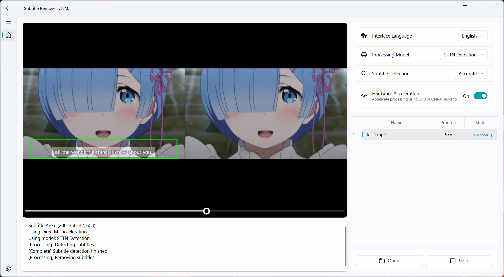

简体中文 | [English](README_en.md)

## 项目简介


[](https://hub.docker.com/r/eritpchy/video-subtitle-remover)

Video-subtitle-remover (VSR) 是一款基于AI技术，将视频中的硬字幕去除的软件。
主要实现了以下功能：
- **无损分辨率**将视频中的硬字幕去除，生成去除字幕后的文件
- 通过超强AI算法模型，对去除字幕文本的区域进行填充（非相邻像素填充与马赛克去除）
- 支持自定义字幕位置，仅去除定义位置中的字幕（传入位置）
- 支持全视频自动去除所有文本（不传入位置）
- 支持多选图片批量去除水印文本



**使用说明：**

- 有使用问题请加群讨论，QQ群：210150985（已满）、806152575（已满）、816881808（已满）、295894827
- 直接下载压缩包解压运行，如果不能运行再按照下面的教程，尝试源码安装conda环境运行

**下载地址：**

Windows GPU版本v1.1.0（GPU）：

- 百度网盘:  <a href="https://pan.baidu.com/s/1zR6CjRztmOGBbOkqK8R1Ng?pwd=vsr1">vsr_windows_gpu_v1.1.0.zip</a> 提取码：**vsr1**

- Google Drive:  <a href="https://drive.google.com/drive/folders/1NRgLNoHHOmdO4GxLhkPbHsYfMOB_3Elr?usp=sharing">vsr_windows_gpu_v1.1.0.zip</a> 

**预构建包对比说明**：
|       预构建包名          | Python  | Paddle | Torch | 环境                          | 支持的计算能力范围|
|---------------|------------|--------------|--------------|-----------------------------|----------|
| `vsr-windows-cpu.7z`              | 3.12 | 3.0.0 | 2.7.0 | 通用                 | 通用       |
| `vsr-windows-directml.7z`         | 3.12 | 3.0.0 | 2.4.1 | Windows 非Nvidia显卡 | 通用       |
| `vsr-windows-nvidia-cuda-11.8.7z` | 3.12 | 3.0.0 | 2.7.0 | CUDA 11.8           | 3.5 – 8.9  |
| `vsr-windows-nvidia-cuda-12.6.7z` | 3.12 | 3.0.0 | 2.7.0 | CUDA 12.6           | 5.0 – 8.9  |
| `vsr-windows-nvidia-cuda-12.8.7z` | 3.12 | 3.0.0 | 2.7.0 | CUDA 12.8           | 5.0 – 9.0+ |

> NVIDIA官方提供了各GPU型号的计算能力列表，您可以参考链接: [CUDA GPUs](https://developer.nvidia.com/cuda-gpus) 查看你的GPU适合哪个CUDA版本

**Docker版本：**
```shell
  # Nvidia 10 20 30系显卡
  docker run -it --name vsr --gpus all eritpchy/video-subtitle-remover:1.2.0-cuda11.8 python backend/main.py -i test/test.mp4 -o test/test_no_sub.mp4

  # Nvidia 40系显卡
  docker run -it --name vsr --gpus all eritpchy/video-subtitle-remover:1.2.0-cuda12.6 python backend/main.py -i test/test.mp4 -o test/test_no_sub.mp4

  # Nvidia 50系显卡
  docker run -it --name vsr --gpus all eritpchy/video-subtitle-remover:1.2.0-cuda12.8 python backend/main.py -i test/test.mp4 -o test/test_no_sub.mp4

  # AMD / Intel 独显 集显
  docker run -it --name vsr --gpus all eritpchy/video-subtitle-remover:1.2.0-directml python backend/main.py -i test/test.mp4 -o test/test_no_sub.mp4

  # CPU
  docker run -it --name vsr --gpus all eritpchy/video-subtitle-remover:1.2.0-cpu python backend/main.py -i test/test.mp4 -o test/test_no_sub.mp4

  # 导出视频
  docker cp vsr:/vsr/test/test_no_sub.mp4 ./
```

**命令行参数：**
```
Video Subtitle Remover Command Line Tool

options:
  -h, --help            show this help message and exit
  --input INPUT, -i INPUT
                        Input video file path
  --output OUTPUT, -o OUTPUT
                        Output video file path (optional)
  --subtitle-area-coords YMIN YMAX XMIN XMAX, -c YMIN YMAX XMIN XMAX
                        Subtitle area coordinates (ymin ymax xmin xmax). Can be specified multiple times for multiple areas.
  --inpaint-mode {sttn-auto,sttn-det,lama,propainter,opencv}
                        Inpaint mode, default is sttn-auto
```
## 演示

- GUI版：

<p style="text-align:center;"></p>

- <a href="https://b23.tv/guEbl9C">点击查看演示视频👇</a>

<p style="text-align:center;"><a href="https://b23.tv/guEbl9C"></a></p>

## 源码使用说明


#### 1. 安装 Python

请确保您已经安装了 Python 3.12+。

- Windows 用户可以前往 [Python 官网](https://www.python.org/downloads/windows/) 下载并安装 Python。
- MacOS 用户可以使用 Homebrew 安装：
  ```shell
  brew install python@3.12
  ```
- Linux 用户可以使用包管理器安装，例如 Ubuntu/Debian：
  ```shell
  sudo apt update && sudo apt install python3.12 python3.12-venv python3.12-dev
  ```

#### 2. 安装依赖文件

请使用虚拟环境来管理项目依赖，避免与系统环境冲突。

（1）创建虚拟环境并激活
```shell
python -m venv videoEnv
```

- Windows：
```shell
videoEnv\\Scripts\\activate
```
- MacOS/Linux：
```shell
source videoEnv/bin/activate
```

#### 3. 创建并激活项目目录

切换到源码所在目录：
```shell
cd <源码所在目录>
```
> 例如：如果您的源代码放在 D 盘的 tools 文件夹下，并且源代码的文件夹名为 video-subtitle-remover，则输入：
> ```shell
> cd D:/tools/video-subtitle-remover-main
> ```

#### 4. 安装合适的运行环境

本项目支持 CUDA（NVIDIA显卡加速）、CPU（无 GPU）和 DirectML（AMD、Intel等GPU/APU加速）三种运行模式。

##### (1) CUDA（NVIDIA 显卡用户）

> 请确保您的 NVIDIA 显卡驱动支持所选 CUDA 版本。

- 推荐 CUDA 11.8，对应 cuDNN 8.6.0。

- 安装 CUDA：
  - Windows：[CUDA 11.8 下载](https://developer.download.nvidia.com/compute/cuda/11.8.0/local_installers/cuda_11.8.0_522.06_windows.exe)
  - Linux：
    ```shell
    wget https://developer.download.nvidia.com/compute/cuda/11.8.0/local_installers/cuda_11.8.0_520.61.05_linux.run
    sudo sh cuda_11.8.0_520.61.05_linux.run
    ```
  - MacOS 不支持 CUDA。

- 安装 cuDNN（CUDA 11.8 对应 cuDNN 8.6.0）：
  - [Windows cuDNN 8.6.0 下载](https://developer.download.nvidia.cn/compute/redist/cudnn/v8.6.0/local_installers/11.8/cudnn-windows-x86_64-8.6.0.163_cuda11-archive.zip)
  - [Linux cuDNN 8.6.0 下载](https://developer.download.nvidia.cn/compute/redist/cudnn/v8.6.0/local_installers/11.8/cudnn-linux-x86_64-8.6.0.163_cuda11-archive.tar.xz)
  - 安装方法请参考 NVIDIA 官方文档。

- 安装 PaddlePaddle GPU 版本（CUDA 11.8）：
  ```shell
  pip install paddlepaddle-gpu==3.0.0 -i https://www.paddlepaddle.org.cn/packages/stable/cu118/
  ```
- 安装 Torch GPU 版本（CUDA 11.8）：
  ```shell
  pip install torch==2.7.0 torchvision==0.22.0 --index-url https://download.pytorch.org/whl/cu118
  ```

- 安装其他依赖
  ```shell
  pip install -r requirements.txt
  ```

- Linux系统还需要安装

  ```shell
  # for cuda 12.x
  pip install onnxruntime-gpu==1.22.0
  # for cuda 11.x
  pip install onnxruntime-gpu==1.20.1 --index-url https://aiinfra.pkgs.visualstudio.com/PublicPackages/_packaging/onnxruntime-cuda-11/pypi/simple/
  ```
  > 详情见: [Install ONNX Runtime](https://onnxruntime.ai/docs/install/#install-onnx-runtime-gpu-cuda-12x)

##### (2) DirectML（AMD、Intel等GPU/APU加速卡用户）

- 适用于 Windows 设备的 AMD/NVIDIA/Intel GPU。
- 安装 ONNX Runtime DirectML 版本：
  ```shell
  pip install paddlepaddle==3.0.0 -i https://www.paddlepaddle.org.cn/packages/stable/cpu/
  pip install -r requirements.txt
  pip install torch_directml==0.2.5.dev240914
  ```
##### (3) CPU 运行（无 GPU 加速）

- 适用于没有 GPU 或不希望使用 GPU 的情况。
  ```shell
  pip install paddlepaddle==3.0.0 -i https://www.paddlepaddle.org.cn/packages/stable/cpu/
  pip install torch==2.7.0 torchvision==0.22.0
  pip install -r requirements.txt
  ```

#### 4. 运行程序

- 运行图形化界面

```shell
python gui.py
```

- 运行命令行版本(CLI)

```shell
python ./backend/main.py
```

## 常见问题
1. 提取速度慢怎么办

修改backend/config.py中的参数，可以大幅度提高去除速度
```python
MODE = InpaintMode.STTN  # 设置为STTN算法
STTN_SKIP_DETECTION = True # 跳过字幕检测，跳过后可能会导致要去除的字幕遗漏或者误伤不需要去除字幕的视频帧
```

2. 视频去除效果不好怎么办

修改backend/config.py中的参数，尝试不同的去除算法，算法介绍

> - InpaintMode.STTN 算法：对于真人视频效果较好，速度快，可以跳过字幕检测
> - InpaintMode.LAMA 算法：对于图片效果最好，对动画类视频效果好，速度一般，不可以跳过字幕检测
> - InpaintMode.PROPAINTER 算法： 需要消耗大量显存，速度较慢，对运动非常剧烈的视频效果较好

- 使用STTN算法

```python
MODE = InpaintMode.STTN  # 设置为STTN算法
# 相邻帧数, 调大会增加显存占用，效果变好
STTN_NEIGHBOR_STRIDE = 10
# 参考帧长度, 调大会增加显存占用，效果变好
STTN_REFERENCE_LENGTH = 10
# 设置STTN算法最大同时处理的帧数量，设置越大速度越慢，但效果越好
# 要保证STTN_MAX_LOAD_NUM大于STTN_NEIGHBOR_STRIDE和STTN_REFERENCE_LENGTH
STTN_MAX_LOAD_NUM = 30
```
- 使用LAMA算法
```python
MODE = InpaintMode.LAMA  # 设置为STTN算法
LAMA_SUPER_FAST = False  # 保证效果
```

> 如果对模型去字幕的效果不满意，可以查看design文件夹里面的训练方法，利用backend/tools/train里面的代码进行训练，然后将训练的模型替换旧模型即可

3. CondaHTTPError

将项目中的.condarc放在用户目录下(C:/Users/<你的用户名>)，如果用户目录已经存在该文件则覆盖

解决方案：https://zhuanlan.zhihu.com/p/260034241

4. 7z文件解压错误

解决方案：升级7-zip解压程序到最新版本


## 赞助


| 捐赠者                       | 累计捐赠金额     | 赞助席位 |
|---------------------------|------------| --- |
| 坤V                        | 400.00 RMB | 金牌赞助席位 |
| Jenkit                        | 200.00 RMB | 金牌赞助席位 |
| 子车松兰                        | 188.00 RMB | 金牌赞助席位 |
| 落花未逝                        | 100.00 RMB | 金牌赞助席位 |
| 张音乐                        | 100.00 RMB | 金牌赞助席位 |
| 麦格                        | 100.00 RMB | 金牌赞助席位 |
| 无痕                        | 100.00 RMB | 金牌赞助席位 |
| wr                        | 100.00 RMB | 金牌赞助席位 |
| 陈                        | 100.00 RMB | 金牌赞助席位 |
| TalkLuv                   | 50.00 RMB  | 银牌赞助席位 |
| 陈凯                        | 50.00 RMB  | 银牌赞助席位 |
| Tshuang                   | 20.00 RMB  | 银牌赞助席位 |
| 很奇异                       | 15.00 RMB  | 银牌赞助席位 |
| 郭鑫                       | 12.00 RMB  | 银牌赞助席位 |
| 生活不止眼前的苟且                        | 10.00 RMB  | 铜牌赞助席位 |
| 何斐                        | 10.00 RMB  | 铜牌赞助席位 |
| 老猫                        | 8.80 RMB   | 铜牌赞助席位 |
| 伍六七                      | 7.77 RMB   | 铜牌赞助席位 |
| 长缨在手                      | 6.00 RMB   | 铜牌赞助席位 |
| 无忌                      | 6.00 RMB   | 铜牌赞助席位 |
| Stephen                   | 2.00 RMB   | 铜牌赞助席位 |
| Leo                       | 1.00 RMB   | 铜牌赞助席位 |
